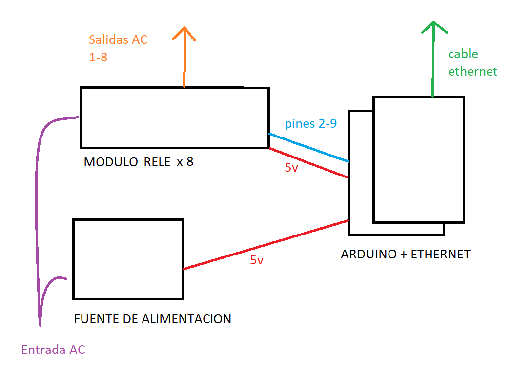

# Arduino Relay Server

Este es un proyecto para controlar una zapatilla mediante un Arduino con la placa Ethernet, exponiendo una pagina web.

# Tecnologias
- Arduino Uno v3
- Ethernet Shield
- 8x Relay Module
- LCD I2C display
- Carcasa y fuente de servidor viejo

